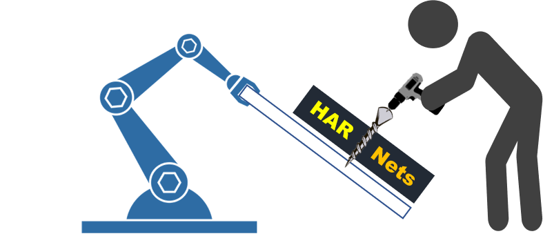

# Human Activity Recognition Networks (HARNets)

<p align="center">
  
</p>


## Introduction

Prediction of human activity and detection of subsequent actions is crucial for improving the interaction between humans and robots during collaborative operations. Deep-learning techniques are being applied to recognize human activities, including industrial applications. However, the lack of sufficient dataset in the industrial domain and complexities of some industrial activities such as screw driving, assembling small parts, and others affect the model development and testing of human activities. Recently, the InHard dataset (Industrial Human Activity Recognition Dataset) has been published to facilitate industrial human activity recognition for better human-robot collaboration, which still lacks extended evaluation. In this regard, we employ human activity recognition memory and sequential networks (HARNets) combining convolutional neural network (CNN) and long short-term memory (LSTM) techniques. 

## Prerequisites

+ tensorflow>=1.13.1
+ Keras>=2.0.2
+ numpy>=1.12.1
+ pandas>=0.19.2
+ scipy>=1.0.1
+ matplotlib>=2.0.0
+ Pillow>=2.1.0
+ h5py>=2.7.0


## Objective 

+ Investigate suitable deep-learning methods for human activity recognition.
+ Evaluate public datasets for Industrial Human activity recognition (HAR) e.g., using InHARD (Indutrial Huamn Action Recognition) dataset 
+ Create public repository consisting code for training and prediction for 3 data types of human activity: Skeleton, RGB Video and Video based Skeleton.

## Methodology 
+ ### Spatial based activity recognition using RGB data
> It is a world scene captured e.g., from top view to visualize the human activity using optical camera (RGB data).

+ ### IMU based activity recognition using BVH data
> Skeleton data are present in form of biovision hierarchy format (BVH) which consists of a hierarchy of body joints and its coordinates with a time-stamp.

+ ### Open pose based activity recognition using RGD data
> This method detects and maps the key points of the human body on RGB video data.

## Results

Dividing the InHard datasets into short activity (SA) and long activity (LA), we obtained the followed results. The results are from IMU dataset, RGB side view and RGB spatial view (RGB-SP) which is typically from top view.

| No. of Hidden Layers | Scenario  | Training accuracy % (Batchsize 4) | Training accuracy % (Batchsize 8) | Training accuracy % (Batchsize 16) | Validation accuracy % (Batchsize 4) |  Validation accuracy % (Batchsize 8) |  Validation accuracy % (Batchsize 16) |
| -------------------- | --------- | -- | -- | --- | -- | -- | --- |
| 1                    | IMU-SA    | 91 | 98 | 90  | 64 | 65 | 70  |
|                      | IMU-LA    | 95 | 97 | 99  | 65 | 72 | 68  |
|                      | RGB-SA    | 85 | 88 | 92  | 68 | 69 | 67  |
|                      | RGB-LA    | 90 | 88 | 90  | 62 | 61 | 58  |
|                      | RGB-SP-SA | 74 | 75 | 75  | 70 | 72 | 73  |
|                      | RGB-SP-LA | 71 | 71 | 73  | 69 | 70 | 71  |
| 2                    | IMU-SA    | 91 | 94 | 96  | 67 | 70 | 69  |
|                      | IMU-LA    | 90 | 98 | 95  | 65 | 76 | 72  |
|                      | RGB-SA    | 85 | 91 | 91  | 67 | 70 | 67  |
|                      | RGB-LA    | 90 | 92 | 92  | 63 | 63 | 61  |
|                      | RGB-SP-SA | 70 | 77 | 79  | 69 | 75 | 75  |
|                      | RGB-SP-LA | 75 | 75 | 78  | 68 | 72 | 71  |
| 3                    | IMU-SA    | 90 | 85 | 94  | 70 | 70 | 72  |
|                      | IMU-LA    | 91 | 96 | 98  | 70 | 68 | 69  |
|                      | RGB-SA    | 87 | 81 | 89  | 69 | 68 | 75  |
|                      | RGB-LA    | 89 | 84 | 91  | 65 | 61 | 61  |
|                      | RGB-SP-SA | 72 | 74 | 79  | 68 | 72 | 71  |
|                      | RGB-SP-LA | 75 | 76 | 74  | 68 | 69 | 70  |


## Getting started with _HARNets_? 

+ In order to use the HARNets, there are three networks given in the source code. These are for spatial activity recognition (RGB based), IMU based activity recognition (Skeleton) and RGB open pose activity recognition (2D). The networks use LSTM and CNN networks on Tensorflow architecture. 

### Spatial based activity recognition using RGB data

+ __Following are the steps for training a model CNN + LSTM and prediction for video RGB data__


1. Place the videos in data/train and data/test folders. Each video type should have its own folder as shown below.

```
	| data/test
		| Assembly
                    |Activity_sample_01.mp4
                    |Activity_sample_02.mp4
                               :
		| picking_front
                    |Activity_sample_01.mp4
                    |Activity_sample_02.mp4
                               :
	| data/train
		| Assembly
                    |Activity_sample_01.mp4
                    |Activity_sample_02.mp4
                               :
		| Picking_front
                    |Activity_sample_01.mp4
                    |Activity_sample_02.mp4
                               :
		...
```

2. Extract frames from video using script **extract_files.py** in data folder.

```
$ python extract_frames.py
```


3. Following Parameter can be set as per the user requirement in rgb_traning.py before traning
```
         i) sequence_length = 50 or 20 or 70 - should be minimum to process all data. defult is 50
         ii) class_limit = 9 - No. of classes
         iii) image_height = 300 - height of video. defult is 300.
         iv) image_width args = 500 - width of video frame. defult is 500. 
```

4. Run train.py script for traning of CNN + LSTM model with sequence_length, class_limit, image_height, image_width args.
  
```
$ python rgb_training.py
```

5. The best model will be saved in Data/Checkpoints file.


6. To evaluate model on test dataset and get a confusion matrix (Note: before running python script please copy the saved model to same folder and change the name of model to copied one in script)

```
$ python rgb_evaluation.py
``` 


__Prediction__

1. To predict the activity from video, copy the tranined weight file to main directory.

2. Set the following paprameter in predict.py file

```
        sequence_length = Sequences of frame to be process (should be equal to value during training).
        class_limit = No. of Class to be consider for training.
        saved_model_file = Name of trained model weight.
        video_filename = Name of video file you want to predict.
```

3. Use predict.py script to predict the activity from video.

```
$ python predict.py
```


### IMU based activity recognition using BVH data


__Following are the steps for training a model (LSTM) and prediction for Skeleton data__ 

1. Place the Skeleton BVH files in Dataset folders. Each BVH file should have its own folder as shown below.
```
	| Dataset/
              | Assemble_system/
                   |Activity_sample_01.bvh
                   |Activity_sample_02.bvh
                             :
              | Picking_front/
                   |Activity_sample_01.bvh
                   |Activity_sample_02.bvh
                             :
              | Turn_Sheets/
                   |Activity_sample_01.bvh
                   |Activity_sample_02.bvh
                             :
		...
```


2. Following Parameter can be set as per the user requirement.

```
        i) nrows = 200 or 150 - No. of rows to read from the each CSV. defult is 200.
        ii) time_steps = 200 or 150 - Decides the row data to be consider for traning (length of the activity.)
        iii) Batch size = 4, 8 or 16. defult is 8
        iv) epochs = As per user. defult is 300.
        Note: nrows and time_steps should be equal for good results.
```


3. After setting the above papramete manually Run the '**Skeleton_LSTM_Training.py**' to train the LSTM model for Skeleton data.

```
$ python Skeleton_LSTM_Training.py
```


4. The above python script will save the trained model weight as 'Skeleton_model.h5', plot and saves confusion matrix, traning accuracy and traning loss graph 


__Prediction__


1. Copy the saved model weight file (.h5) to same directory which contain Skeleton_Prediction.py python script. 

2. Put the BVH file you want to get predicted into 'file_to_predict' folder.

3. Run the 'Skeleton_prediction.py' python script to get a prediction of classes. 

```
$ python Skeleton_Prediction.py
```


### Open pose based activity recognition using RGD data
This approach has employed a model from [Open pose](https://github.com/CMU-Perceptual-Computing-Lab/openpose).


## DataSet 
+ You could access the InHard Dataset [here](https://zenodo.org/record/4003541#.Yh3xS-jMKUl).

## References
+ If you want to use this model or code, please cite our paper [here](https://protech.mb.uni-siegen.de/fams/research/publications/XX)
+ [InHard Dataset](https://zenodo.org/record/4003541#.Yh3xS-jMKUl)
+ [Open pose](https://github.com/CMU-Perceptual-Computing-Lab/openpose) 
+ RGB Video classification [here](https://github.com/harvitronix/continuous-online-video-classification-blog) or [here](https://github.com/SBoyNumber1/LSTM-video-classification) 

## Contribution
This work has been conducted at the University of Siegen, Germany, [Institute of Production Technology](https://protech.mb.uni-siegen.de/).

+ [Tadele Belay Tuli](https://tadeletuli.com)
+ [Valay Mukesh](https://github.com/Valayramani)


## Citation
```
 @inproceedings{Tuli-cpsl2022,
   title={Industrial Human Activity Prediction and Detection Using Sequential Memory Networks},
   author={Tuli, Tadele Belay and Patel, Valay Mukesh and Manns, Martin },
   booktitle={Conference on production systems and logistics (CPSL 2022)},
   year={2022},
 } 

```
## Disclaimer

We do not own any license for modules or packages that are used in our model. Please check the specific license requirements for further use. 
